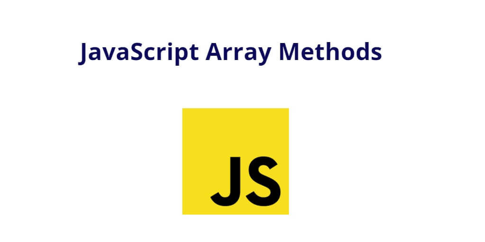

### Array Methods
----


### What is an Array in JavaScript?  
In Javascript, arrays aren't primitives but are instead Array objects with the following core characteristic:   
- JavaScript arrays are resizable an can contain a mix of different data types.  
- JavaScript arrays are not associative arrays and so array elements cannot be accessed using arbitary strings as indexes, but must be accessed using nonnegative integers as index
- JavaScirpt arrays are zero-indexed, the first element of an array is at index 0, the second is at index 1 and son on - and the last element of an array's length property minus 1.


#### Array Declaration -  
The Array can be declare in two ways -   
- `let array = new Array()`   
- `let arr = []`


#### NOTE -   
- The start index is always inclusive which means it will be included and the end index will be always exclusive which means it will be excluded.
- Array.length is use to find the length of the arrays


**Arrays provide a lots of methods which make things easier while handling the array. The methods can be split into groups, They are -**
1. **To add/remove elements.**
1. **To search among elements.**
1. **To iterate over elements.**
1. **To transform the array.**


#### 1. To add/remove elements. -
**The push()** methods adds one or more elements to the end of an array and returns the new length of the array.    
``
const fruits = ["mango", "banana", "apple"];
fruits.push("watermelon");
console.log(fruits)  
//output- ["mango", "banana", "apple", "watermelon"]
``    

**The pop()** method remove the last element from an array an returns that element.  
``
fruits.pop()
console.log(fruits)  
//output - ["mango", "banana", "apple"]
``     

**The unshift()** method adds one or more elements to the beginning of an array and returns the new length of the array. It modify the original array.
```javaScript
const num = [1, 2, 3];
num.ushift(5)
console.log(num)   
//output - [5, 1, 2, 3]
```    
**The shift()** method removes the first element from an array and returns that removed element.
```javascript
num.shift()
console.log(num)   
//output - [1, 2, 3]
```    
**The splice()** method changes the content of an array by removing or replacing existing elements or adding new elements in place.
`syntax - Array.splice(start) or Array.splice(start, deleteCount) or Array.splice(start, deleteCount, item1, item2.. , itemN)`

```javascript
const week = ["monday", "tuesday", "wednesday", "sunday"]
week.splice(3, 1, "Thursday", "Friday", "Saturday", "Sunday")
console.log(week)    
//output - ["monday", "tuesday", "wednesday", "Thursday", "Friday", "Saturday", "Sunday"]
```  
**The slice()** method returns a shallow copy of a portion of an array into a new array selected from start(inclusive) to end(exclusive). The original array will not be modified.   
`syntax - Array.slice(start, end(optional))`

```javascript
const birds = ["parrot", "crow", "humming bird", "Peacock"];
const sliceArray = birds.slice(2)
console.log(sliceArray)    
//output - ["humming bird", "Peacock"]   
```   
**The concat()** method is used to merge two or more arrays. This method does not change the existing arrays. But instead returns a new array.
`syntax- Array1.concate(Array2)`

```javascript
const arr1 = [1, 2, 3, 4, 5, 6]
const arr2 = [7, 8, 9, 10, 11, 12]
const arr3 = arr1.concat(arr2)
console.log(arr3)    
//output - [1, 2, 3, 4, 5, 6, 7, 8, 9, 10, 11, 12]
```    

**The from()** static method creates a new, shallow-copied Array instances from an iterable or array like object.

```javascript
console.log(Array.from('foo'))   
//output - ["f", "o", "o"]
```    

#### 2. To search among elements -
**The indexOf()** method returns the first index at which a given element can be found in the array, or -1 if it is not present.
`syntax- Array.indexOf(searchElement) or Array.indexOf(searchElement, fromIndex)`

```javascript
const names = ["rahul", "john", "preety", "samuel"];
console.log(names.indexOf("john"));  
//output - 1 (since index of array count from 0)
```    

**The at()** method takes an integer value and returns the item at that index, allowing fro positive and negative integers, Negative integers count back from the last item the array
`syntax -  Array.at(index)`

```javascript
const myPets = ["dog", "cat", "fish"]
const mycat = myPets.at(1)   
//output - cat
```   
**The lastIndexOf()** method returns the last index at which a given element can be found in the array, or -1, if its is not present. The array is searched backwards, starting at fromIndex
`syntax - Array.lastIndexOf(searchElement) or Array.lastIndexOf(searchElement, fromIndex)`

```javascript
const movies = ["spiderman" "batman", "superman", "ironman"]
const myfav = movies.lastIndexOf("batman")   
//output - 2 since its counting from the end of the array.
```   

**The find()** method returns the first element in the provided array that satisfies the provided testing function. if no values satisfy the testing function. undefined is returned.
`syntax - find(func)`

```javascript
const numbers = [15, 12, 8, 130, 44];
const found = numbers.find((e) => e > 10)
console.log(found)  
// output- 12 it return 12, since it is the first item to satisfy the condition.
```


**The filter()** method creates a shallow copy of a portion of a given array, filtered down to jst the element from the given array that pass the test implemented by the provided function.   
`syntax- Array.filter(func)`

```javascript
const course = ["science", "eco", "Math", "GK"];
const abr_course = course.filter((c) => c.length < 4);
console.log(abr_course)   
//output - ["eco", "GK"]   
```   

**The findIndex** method returns the index of he first element in an array that satisfies the provide testing function. if no elements satisfy the testing function, -1 is returned.
`syntax- Array.findIndex(func)`    

```javascript
const ranNum = [8, 10, 12, 190, 6]
console.log(ranNum.findIndex(e => e > 10))   
//output - 2
```

#### 3. To iterate over elements - 
**The forEach()** method executes a provided function once for each array element. It does not modified the original array.  
`syntax- forEach(func)`

```javascript
const evenNum - [2, 4, 6, 8]
evenNum.forEach((e) => console.log(e *2))   
//output - 4, 8, 12, 16
```  

**The every()** methods tests whether all elements in the array pass the test implemented by the provided function. It returns a Boolean value true/false.   
`syntax- Array.every(func)`

```javascript
const ages = [20, 18, 32, 40];
const ageCheck = ages.every((e) => e>=18))
console.log(`Age check:- ${ageCheck}`);   
// output - true
```  

#### 4. To Tranform the array - 
**The map()** method creates a new array populated with the results of calling a provided function on every element in the calling array. 
`syntax- Array.map(func)`

```javaScript
const oddNum = [3, 6, 9, 12]
const oddMulti = oddNum.map((e) => e * 3)
console.log(oddMulti)   
//output - [9,18, 27, 36]
```  

**The sort()** method sorts the elements of an array in place and returns the reference to the same array, now sorted. The default sort order is asecending, built upon converting the elements into strings, then comparing their sequences of UTF-16 code units values.   
`syntax- Array.sort(func)`

```javascript
const ranNum =  [4, 8, 1, 4, 7, 10, 20];
const sortedNum = randNum.sort((a,b) => {
return a - b; 
})
console.log(sortedNum);   
//output - [1, 4, 4, 7, 8, 10, 20]
```
**The reverse()** method reverses an array in place and returns the reference to the same array, there first array element now becoming the last and the last array element becoming the first.
`syntax - arr.reverse()` 

```javascript
const stArray = ["one", "two", "three"];
const revArr = stArray.reverse();
console.lgo(revArr)   
//output- ["three", "two", "one"]
```

**The split()** method convert a string to an array
`syntax- Array.split() or Array.split(separator) or Array.split(separator, limit)`

```javascript
const str = "Hello Good Morning";
const strArr = str.split(" ");
console.log(strArr)   
//output - [ 'Hello', 'Good', 'Morning' ]
```  

**The join()** method creates and returns a new string by concatening all of the elements in an array, separated by commas by commas or a specified separator string. if the array has only one item, then that item will be returned without using the separator.    
`syntax- Array.join() or Array.join("separator)`

```javascript
const item = ["hello", "world", "welcome"];
const str1 = item.join("-")
console.log(str1)   
//output - Hello-world-Welcome
```   
**The reduce()** methods executes a user-supplied "reducer" callback function on each element of the array, in order, passing in the return value from the calculatio on the preceeding element.
The final result of running the reducer across alll elements of the array is a single value.
`syntax- Array.reduce((preValue, curVale) => {}, initialValue`

```javascript
const arrNumbers = [1, 2, 3, 4, 5];
const initValue = 0;
const sumArr = arrNumbers.reduce(
  (preValue, curValue) => preValue + curValue,
  initValue
);
console.log(sumArr);    
//output - 15
```  

**The isArray()** method determines whether the passed value is an Array, return true if it is array else false.
`syntax- Array.isArray(value)`

```javascript
const myAr = ["big", "small", "large"];
const chekAr = Array.isArray(myAr);
console.log(chekAr);   
//output - true
```

** The copyWithin()** method shallow copies part of an array to another location in the same array and returns it without modifying its length.
`syntax -Array.copyWithin(target) or Array.copyWithin(target, start) or Array.copyWithin(target, start, end)` 
```javascript
const arr5 = [1, 2, 3, 4, 5];
console.log(arr5.copyWithin(0, 1, 4));
//output - [2, 3, 4, 4, 5]
``` 

**The fill()** method changes all elements in an array to a static value, from a start index (default 0) to an end index(default array.length). It returns the modified array.
`syntax- Array.fill(value) or Array.fill(value, start) or Array.fill(value, start, end)`
```javascript
const arrr = [1,2, 3, 4];
console.log(arrr.fill(8, 2, 4));
//output - [1, 2, 8, 8]
```

**The flat()** method creates a new array with all sub-array elements concatenated into it recursively up to the specified depth and also empty slots in arrays.
`syntax- flat() or flat(depth) depth: the depth level specifying how deep a neste array structure should be flattened. Defaults to 1.`

```javascript
const nesArray = [1, 2, 3, [4, 5]];
const fltArr = nesArray.flat();
console.log(fltArr);   
//output - [1, 2, 3, 4, 5,]
```

**The toString()** metho returns a string representing the specified array and its elements.
`syntax- Array.toString()`

```javascript
const arrEle - [ 100, "BC", "ago"]
console.log(arrEle.toString())    
//output- "100, BC, ago"
```

**For further reading** 
- https://developer.mozilla.org/en-US/docs/Web/JavaScript/Reference/Global_Objects/Array