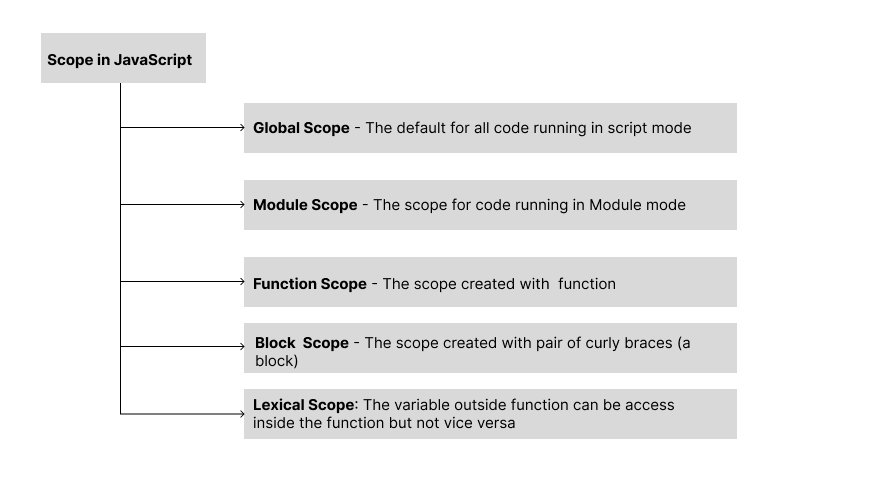

### JavaScript Interview Preparation Cheat Sheet 

   


1. **Scope**
1. **Single Threaded**
1. **Call Stack**
1. **Hoisting**   

#### 1. Scope -  
    1. The scope in Javascript is the current context of execution in which values and expressions are "visible" or can be referenced.
    2. If a variable or expression is not in the current scope, it will not be available for use.
    3. Scopes can also be layered in a hierarchy, so that child scopes have access to parent scopes, but not vice-versa.

   

****
**Global Scope**- 
```javascript
//myScript.js
//global scope variable
const pie = 3.14
console.log(pie)
// output - 3.14, pie can be access throught out the myScript.js file
```

**Module Scope**-
```javascript
//script1.js
const pi = 3.14159
console.log(pi)   // 3.14159
module.export = pi

// script2.js
const pi = require("./script1.js")
console.log(pi) // 3.14159

```  

**Function Scope**- 
```javascript
function Hello(){
// run function scope 
var hello = "Hello"
console.log(hello)
}
hello();
console.log(hello) // throws reference Error, since it can be access within only inside the function.
```

**Block Scope** -    
*Note var variable are not a block scope*
```javascript
{
    const text = "Hello"
    console.log(text) // hello
}
console.log() // throws reference error since text variable is declare inside the curly braces(block)
```
**Lexical Scope** -    
```javascript
function  funOutSide(){
// outer function scope ---
let name = "mang"
function funInner(){
// inner function scope -
console.log(name) // Mang
} 
funInner()
}
funOutSide()
```

#### 2. Single Threaded -    
    a. JavaScript is a single threaded language, which means it has only one call stack that is used to execute the program.
    b. It means that it runs only one thing at a time.
    c. The call stack is same as the stack in data structure which follows FILO, whenever a line of code gets inside the call stack it gets executed and move out of the stack.
    d. It simply means it runs code line by line and must finished executing a piece of code before onto the next.   

```javascript
console.log("One")
setTimeout("Two", 5000)
console.log("Three")
//output - one, three and Two(it wait for 5sec and then print)
```

#### 3. Call Stack -    
A call stack is a mechanism for an interpreter or javaScript engine to keep track of its place in a script that calls multiple functions - what function is currently being run and what functions are called from within that function, etc.  
   
    a. When a script calls a function, the interpreter adds it to the call stack and then starts carrying out the function.  
    b. Any functions that are called by that function are added to the call stack further up, and run where their calls are reached.  
    c. When the current function is finished, the interpreter takes it off the stack and resumes execution where it left off in the last code   listing.  
    d. If the stack takes up more space than it had assigned to it, it results in a "stack overflow" error.     

```javascript
console.log("hello") // hello
function name(){
console.log("Mang") //
}
console.log("Hii")
name()

```
   

#### 4. Hoisting -    
In JavaScript Hoisting  refers to the process where the interpreter appears to move the declaration of functions, variable or classess to the top of their scope, prior to execution of code.

  

1. **Variable Hoisting** - 
    1. Hoisting in variables works too, so we can used the variable in code before it is declared or initialized.
    1. However, JavaScript only hoist declaration, not initialization!
    1. *var hoisting* - Here we declare then initialize the value of var after using it. The default initialization of the var is undefined.
    ```javascript
    console.log(num) // return undefined
    var num;
    num = 6
    console.log(num) // return 6
    ```
    c. *let and const Hoisting* - variable declared with let and const are also hoisted but, unlike var variable declaration, are not initialized with default value. An exception will be thrown if a variable with let or const is read before initialized.
    ```javascript
    console.log(num) // thows reference error exception as the value is uninitialized
    let num = 6 // or const num = 6

    ```    
2. **Function Hoisting** -  One of the advantages of hoisting is that it lets you use a function before you declare it in code.    
```javascript
catName("Tiger")
function catName(name){
console.log("My cat name is", name) 
}
//ouput - My cat name is Tiger
```

2. **Class Hoisting** - classes defined using a class declaration are hoisted, which means that javascript has a reference to the class. However the class is not initialized by default so, any code that uses it before the line in which it is initialized is executed will throw a reference error.   
```javascript
var person = new Person();
person.name = "Jane"
person.age = 32

console.log(person) // Uncaught ReferenceError: Cannot access Person before initialization

class Person (){
constructor(name, age){
    this.name = name;
    this.age = age
}}
```

*For furthere reading check out the orignal documentation on MDN->*  
1. https://developer.mozilla.org/en-US/docs/Web/JavaScript