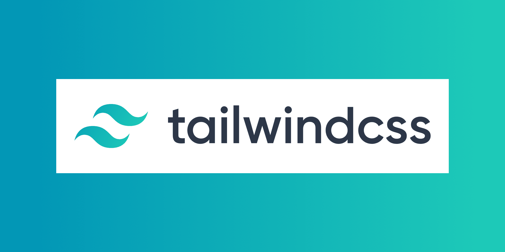
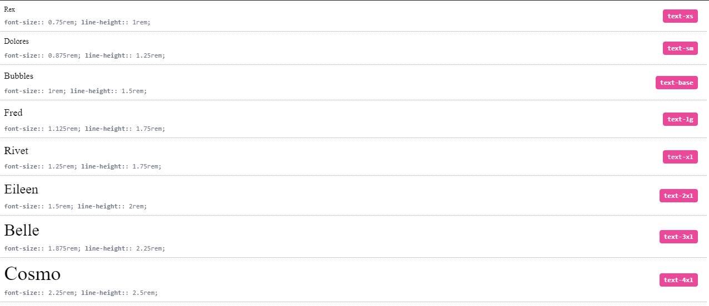

dii

## Getting started with Tailwind CSS
----
   


### What is Tailwind CSS -   
----
Tailwind CSS is basically a utility-first CSS framework packed with classes like flex, pt-4, text-center and rotate-90 that can be composed to build any design, directly in your markup for rapidly building modern user interface websites without ever leaving html.

### why Tailwind CSS -   
----
- It focus on utilities that define styles directly like margin, padding, colors and borders.  
- It gives freedoms to define personal desire layouts directly into the component.
- It provides large numbers of modifier and customization that allows developers to control how styles change and media query breaks points, pseudo elements, attribute an even through user setting like dark mode.
- It is best to work with CSS and moduled based frameworks like React, Vue, Angular or Svelte.
- It's fast, flexible, and reliable — with zero-runtime.

### Installation -  
There are four ways of installing Tailwind CSS -
1. Tailwind CLI
2. Using PostCSS 
3. framework Guides  
4. Play CDN    
However only Play CDN will be cover in this blog, for others installation, [check out the official documentation](https://tailwindcss.com/docs/installation: "Tailwind official documentation")

#### Play CDN -    
Play CDN is use to try Tailwind right away in the browser without any build step.    

**Play CDN steps installation**
1. Add the  Play CDN script in the head section of the HTML   
 `<script src="https://cdn.tailwindcss.com"></script>`
1. add the config file and edit to add some custom CSS  
`<script>
    tailwind.config = {
      theme: {
        extend: {
          colors: {
            clifford: '#da373d',
          }
        }
      }
    }
  </script>`
----  

### Utility-first Features -
1. **Preflight**:   
The Tailwind CSS reset your CSS styles. The reset in Tailwind CSS is called Preflight and it does a lot of things. So, for example, it takes care of removing all the default margin in just about everything: paragraph, unstyled heading, list unstyled, block images, borders reset. Basically what it does is, it reset all the default value of the CSS and allow us to start applying our CSS from scratch without any predefine or Default CSS properties.   
**Disable Preflight**: Incase of integrating Tailwind into an existing project or because you'd like to provide your own base styles. All you need to do is set `Preflight` to `false` in the corePlugins section of your tailwind.config.js     
    `tailwind.config = {
      corePlugins: {
        preflight: false,
      }
    }`   

    **Extending Preflight**: Own base custom styles can be added on top of the Preflight by simpling adding CSS in side the `@layer base`.   
    `@tailwind base;         
    @layer base {       
    h1 {     
    @apply text-2xl;
    }
    }
    @tailwind components;
    @tailwind utilities;`

2. **Color Classes**: Tailwind includes an expertly-crafted default color palette out-of-the-box that is a great starting point if you don’t have your own specific branding in mind. Color are defined from strength levels from 50 to 900    
     
  Color classes can be of - 
    - `background(bg-COL-STR)`  i.e `bg-red-300` background color of light red.
    -  `Text-COL-STR`      ie.e `text-sky-400/75` text color of sky color with 400 strength and 75 opacity     
    - `bg(-none) | (-gradient-to) (-DIR)` i.e `bg-gradient-to-r from-cyan-500 to-blue-500` gradient color of cyan 500 to blue 500 from right.   
3. **Shorcut classes**: 
    - **font Family** - `font-family: sans-serif` i.e `font-sans`, `font-family: serif` i.e `font-serif`, `font-family: monospace` i.e `font-mono`
    - **font Size** - Font size can be of `xs, sm, base, lg, xl, 2xl, 3xl, 4xl, 5xl, 6xl, 7xl, 8xl and 9xl`
       
    - **box-shadow**- it can be `shadow-sm, shadow-md, shadow-lg, shadow-xl or shadow-2xl, shadow-inner, shadow-none`    

4. **Special classes**:     
    - **Divide** - Utilities for controlling the border width between two elements. `divide-y-{width}` i.e add borders between vertically stacked elements horizontally, `divide-x-{width}` i.e add borders between horizontal element vertically. 
    - **Ring**- utilities for creating outline rings with box-shadows. `ring-offset-2 ring-2` which create outline size of 2px width. `ring-innerset-2 ring-2` which create innerline size of 2px width  

5. **Responsive Design**: 
    - Arbitary Sizing `sm: minwidth of 640px`, `md: mindwidth of 768px`, `lg: min-width of 1024px`, `xl: min-width of 1280px` and `2xl: min-width of 1536px`
    
6. **Custom Properties**    
  - any defualt value of the framework can be change, things like color palette, spacing scale, typography scale, or breakpoints, add your customizations to the `theme` section of the config file or by simply using arbitrary values.
  -  using arbitrary values - `syntax- class-[customValue]` i.e `top-[100px]`
  ```javascript
   //`tailwin.config.js file`
  module.exports = {
  theme: {
    screens: {
      sm: '480px',
     
    },
    colors: {
      'blue': '#1fb6ff',
      
    },
    fontFamily: {
      sans: ['Graphik', 'sans-serif'],
     
    },
    extend: {
      spacing: {
        '128': '32rem',
        '
      },
      borderRadius: {
        '4xl': '2rem',
      }
    }
  }
}
  ```    

** Further reading**
- https://tailwindcss.com/docs/installation